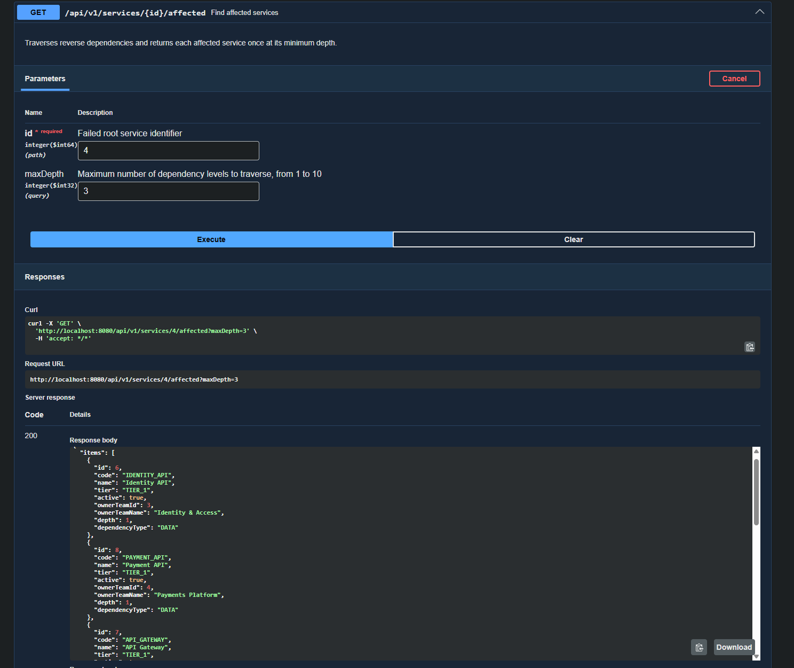
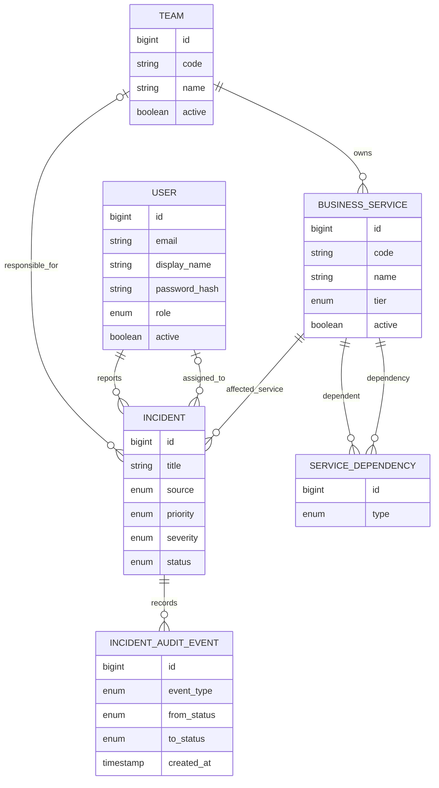

# IncidentHub

[](https://github.com/6yJlka/incident-hub/actions/workflows/ci.yml)

IncidentHub — backend-сервис для регистрации и обработки внутренних технических инцидентов. Он связывает инциденты с каталогом бизнес-услуг и помогает определить влияние сбоя по графу зависимостей.

Проект вдохновлён внутренней SRE-платформой Т-Банка [FineDog](https://www.tbank.ru/career/technologies/finedog/). Отсюда и главное архитектурное решение: центром модели является не заявка, а каталог услуг. Инцидент привязан к конкретной сломанной услуге, ответственная команда выводится из её владельца, а граф зависимостей отвечает на вопрос, кто ещё пострадает.

## Как запустить

Для обычного запуска нужны Docker и Docker Compose:

```bash
docker compose up --build
```

Для запуска с демонстрационными командами, пользователями, услугами, зависимостями и инцидентами:

```bash
SPRING_PROFILES_ACTIVE=demo docker compose up --build
```

В Windows PowerShell команда для демо-режима выглядит так:

```powershell
$env:SPRING_PROFILES_ACTIVE='demo'; docker compose up --build
```

Следующие учётные данные существуют только в демонстрационном режиме. Профиль `demo` включает локальные настройки JWT, а у всех активных демо-пользователей пароль `demo1234`:

| Роль | Email |
|---|---|
| `REPORTER` | `anna.ivanova@incidenthub.demo` |
| `ENGINEER` | `boris.petrov@incidenthub.demo` |
| `ADMIN` | `olga.smirnova@incidenthub.demo` |

При обычном запуске эти пользователи не создаются: база стартует без демонстрационных учётных записей.

Вне профиля `local` приложение требует переменную `JWT_SECRET` с Base64-encoded секретом длиной не менее 256 бит. Известный локальный секрет из `.env.example` вне этого профиля отвергается при старте. Время жизни access-токена задаётся через `JWT_ACCESS_TOKEN_TTL` в формате `Duration`, по умолчанию `PT1H`.

После запуска приложение доступно на `http://localhost:8080`, Swagger UI — на [http://localhost:8080/swagger-ui.html](http://localhost:8080/swagger-ui.html). При первом старте Docker Compose соберёт приложение, запустит PostgreSQL и применит миграции Flyway. Остановить контейнеры можно командой `docker compose down`.



## Тесты

```bash
./gradlew clean build
```

Из внешних зависимостей требуется только Docker: PostgreSQL для интеграционных тестов поднимается через Testcontainers автоматически, поднимать базу вручную не нужно.

Покрытие включает unit-тесты доменной модели и прикладных сценариев, интеграционные тесты репозиториев и миграций на реальной PostgreSQL, а также MVC-тесты контроллеров с проверкой кодов ответов и формата ошибок. Отдельно проверяется обход графа зависимостей: линейная цепочка, ромб с дедупликацией, цикл, ограничение глубины и несвязанные компоненты графа.

## Что умеет IncidentHub

- Вести каталог бизнес-услуг, их владельцев, уровни критичности и направленные зависимости типов `SYNC`, `ASYNC` и `DATA`.
- Находить услуги, прямо или транзитивно затронутые сбоем, с ограничением глубины обхода и защитой от циклов. Если до услуги ведёт несколько путей, она возвращается один раз — на минимальной глубине.
- Регистрировать инциденты, назначать исполнителя и проводить инцидент по жизненному циклу `OPEN → ASSIGNED → IN_PROGRESS → RESOLVED → CLOSED`; поддерживаются повторное открытие и отмена.
- Хранить неизменяемую историю событий инцидента: создание, назначения и переходы между статусами.
- Регистрировать пользователей и выдавать JWT access-токены по email и паролю; закрытые API работают stateless и требуют Bearer-токен.
- Предоставлять REST API для работы с услугами, командами, пользователями и инцидентами. Интерактивное описание контрактов и выполнение запросов доступны через [Swagger UI](http://localhost:8080/swagger-ui.html), спецификация OpenAPI — по адресу [http://localhost:8080/v3/api-docs](http://localhost:8080/v3/api-docs).

Чтобы выполнить закрытый запрос в Swagger UI, зарегистрируйтесь через `POST /api/v1/auth/register`, войдите через `POST /api/v1/auth/login`, нажмите **Authorize** и вставьте полученный `accessToken`.

Сохраняемый для совместимости `POST /api/v1/users` создаёт пользователя каталога без пароля; такая запись не может войти в систему. Для создания учётной записи с паролем используется `POST /api/v1/auth/register`. Судьба старого эндпоинта будет решена на следующем шаге авторизации.

Ошибки возвращаются в формате `application/problem+json` по RFC 9457, с собственными идентификаторами вида `urn:incident-hub:problem:not-found`. При попытке выполнить недопустимый переход статуса ответ содержит текущий статус инцидента и список статусов, из которых переход разрешён.

## Архитектура

Приложение построено как модульный монолит: оно разворачивается одним процессом и использует одну базу PostgreSQL, а код разделён по бизнес-областям. Такое устройство сохраняет простую эксплуатацию монолита и задаёт явные границы ответственности между частями системы.

| Домен | Ответственность |
|---|---|
| `catalog` | Каталог бизнес-услуг, граф зависимостей и расчёт затронутых услуг |
| `incident` | Регистрация инцидентов, поиск, назначение и жизненный цикл |
| `audit` | Неизменяемая история доменных событий инцидента |
| `team` | Команды-владельцы услуг и ответственные команды |
| `identity` | Пользователи, авторы и исполнители инцидентов |
| `auth` | Регистрация пользователей и проверка учётных данных |
| `security` | Stateless-защита HTTP API, выпуск и проверка JWT |
| `common` | Общая конфигурация API и обработка ошибок |

Внутри доменов код разделён на доменную модель, прикладные сценарии, HTTP-слой и инфраструктуру хранения. Границы выбраны по бизнес-ответственности: каталог отвечает на вопрос о влиянии сбоя, модуль инцидентов управляет работой над ним, а аудит фиксирует произошедшие изменения.

Правила жизненного цикла инкапсулированы в самой сущности инцидента: допустимость перехода проверяет доменная модель, а не прикладной сценарий. Аудит записывается в той же транзакции, что и изменение статуса.

## Стек

| Технология | Версия и назначение |
|---|---|
| Java | 21 |
| Spring Boot | 4.0.7; Web MVC, Data JPA, Validation, Security, Actuator |
| PostgreSQL | 16 Alpine |
| JJWT | 0.13.0; выпуск и проверка JWT |
| springdoc-openapi | 3.0.1; OpenAPI и Swagger UI |
| Gradle | 9.5.1 через Gradle Wrapper |
| Flyway, Hibernate, JUnit | Версии управляются BOM Spring Boot 4.0.7 |
| Testcontainers | Интеграционные тесты с `postgres:16-alpine` |
| Docker Compose | Локальный запуск приложения и базы данных |

## Доменная модель



Зависимость направлена от `dependent` к `dependency`: если недоступна `dependency`, затронутой считается услуга `dependent` и все зависящие от неё услуги. Каждый инцидент относится к одной затронутой услуге, имеет автора и может иметь ответственную команду и назначенного исполнителя.

Критичность и приоритет разведены намеренно: `severity` (`SEV1`–`SEV4`) описывает влияние на бизнес, `priority` — очерёдность работы над инцидентом.

## В планах

- Ролевая авторизация и получение автора запроса из учётной записи.
- Веб-интерфейс для операторов и ответственных команд.
- Бэклог продукта: публичный деплой, текстовая хроника инцидентов, приём событий мониторинга, группировка связанных инцидентов, подписки и эскалации, SLA, постмортемы и аналитика.
